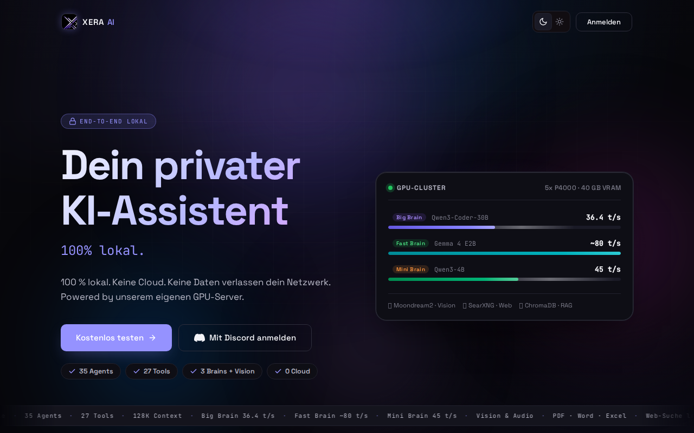
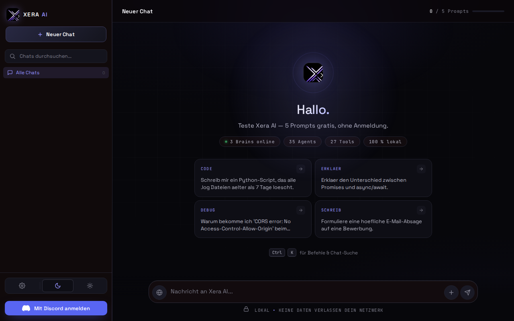
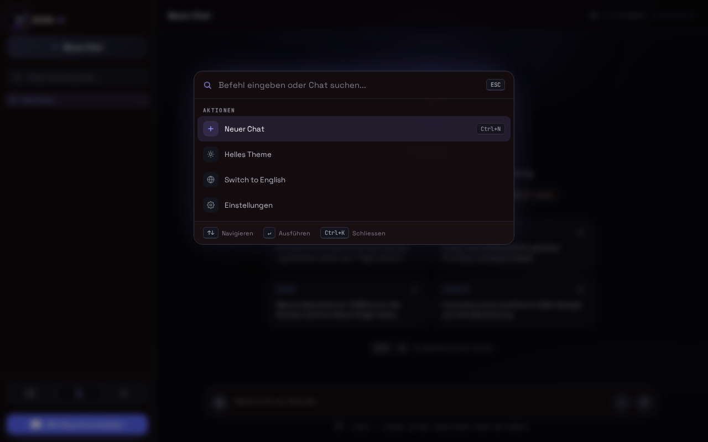
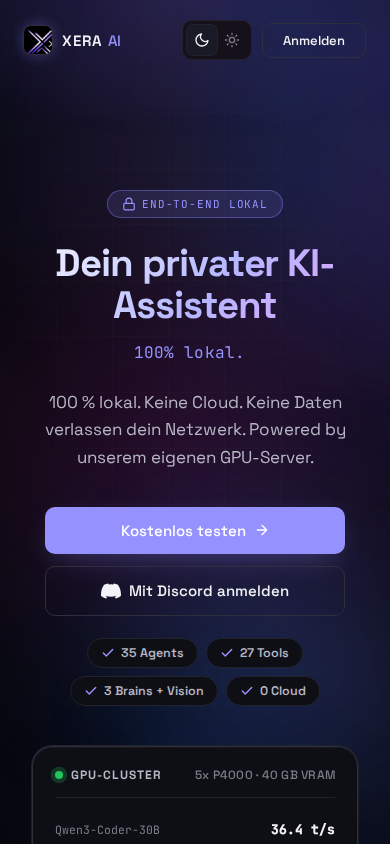

<p align="center">
  
</p>

<h1 align="center">Xera AI</h1>

<p align="center">
  <strong>Self-hosted AI assistant powered by local LLMs — no cloud, no API keys, 100% private.</strong>
</p>

<p align="center">
  <a href="https://xera-app.com">Live Demo</a> &nbsp;·&nbsp;
  <a href="#features">Features</a> &nbsp;·&nbsp;
  <a href="#architecture">Architecture</a> &nbsp;·&nbsp;
  <a href="#setup">Setup</a> &nbsp;·&nbsp;
  <a href="#api-reference">API</a>
</p>

---

## What is Xera AI?

Xera AI is a fully self-hosted AI assistant that runs entirely on your own hardware. It combines multiple local language models with a specialized agent system, giving you a powerful AI that understands your infrastructure — without sending a single byte to the cloud.

Built for homelabbers, sysadmins, and developers who want AI capabilities without sacrificing privacy.

---

## Features

### Multi-Model Routing
Xera automatically selects the best model for each query — or lets you choose manually via the Brain Selector.

| Brain | Model | Parameters | Use Case |
|---|---|---|---|
| **Big Brain** | Qwen3-Coder-30B-A3B | 30B (3B active) | Complex tasks, code, analysis, documents |
| **Fast Brain** | Gemma 4 E2B | 8B | Quick answers, translations, simple questions |
| **Mini Brain** | Qwen3-4B | 4B | Lightweight tasks, code completion |

The router analyzes message complexity using pattern matching: simple greetings and short questions go to Fast Brain, code/config/analysis requests go to Big Brain. Once a conversation has context (prior assistant messages), it stays on Big Brain to maintain coherence.

### 23 Specialized Agents
Each agent has its own system prompt, allowed tools, and assigned brain. The orchestrator analyzes incoming messages and routes them to the best-matching agent automatically.

| Agent | Description | Brain |
|---|---|---|
| **Code** | Code review, debugging, refactoring, generation | big |
| **DevOps** | CI/CD, deployments, infrastructure-as-code | big |
| **Proxmox** | VM/CT management, cluster operations, backups | big |
| **Monitoring** | Grafana, Prometheus, alerting, dashboards | big |
| **Knowledge** | RAG-powered search over Obsidian documentation | big |
| **Research** | Deep-dive analysis with web search | big |
| **Web Search** | Real-time web search via SearXNG with source attribution | big |
| **Security** | Vulnerability scanning, firewall analysis, hardening | big |
| **Network** | VLAN, routing, DNS, VPN diagnostics | big |
| **Docker** | Container management, compose, logs | big |
| **Log Analysis** | Parse and analyze system/application logs | big |
| **Documentation** | Generate technical docs, runbooks, guides | big |
| **Database** | SQL queries, schema design, optimization | big |
| **Backup** | Backup strategies, verification, restore planning | big |
| **Incident Response** | Troubleshooting, root cause analysis, escalation | big |
| **Home Automation** | IoT, smart home, automation workflows | big |
| **Finance** | Budget tracking, cost analysis, forecasting | fast |
| **Content** | Writing, editing, summarization, translation | fast |
| **Discord** | Server management, bot commands, webhook setup | big |
| **Email** | Drafting, templating, mail server configuration | fast |
| **Calendar** | Scheduling, reminders, time management | fast |
| **Document Reader** | Extract and analyze content from uploaded files | big |
| **Document Writer** | Generate PDFs, DOCX, XLSX with custom themes | big |

Agents can delegate tasks to each other using the `delegate_to_agent` tool for multi-step workflows.

### 17 Built-in Tools

| Tool | Description | Access |
|---|---|---|
| `shell_execute` | Execute read-only commands on the GPU server | Homelab |
| `ssh_execute` | Run commands on remote servers (Router, Proxmox nodes, etc.) | Homelab |
| `docker_manage` | List, start, stop, restart containers; read logs | Homelab |
| `monitoring_query` | Query Prometheus (PromQL) and Grafana dashboards | Homelab |
| `knowledge_search` | RAG search over Obsidian documentation (ChromaDB) | Homelab |
| `system_info` | Full system overview: CPU, RAM, disk, GPU, network | Homelab |
| `web_search` | Search the web via SearXNG (Google, DuckDuckGo, Brave) | All |
| `read_file` | Read file contents with line limit | All |
| `write_file` | Create or overwrite files | All |
| `list_files` | List directory contents with sizes and types | All |
| `find_files` | Search for files by pattern | All |
| `delete_file` | Remove files (non-empty dirs blocked for safety) | All |
| `create_directory` | Create directories recursively | All |
| `move_file` | Move or rename files/directories | All |
| `copy_file` | Copy files | All |
| `create_document` | Generate PDF/DOCX/XLSX/code files with download links | All |
| `read_document` | Extract text from uploaded documents (PDF, Word, Excel, PPT) | All |
| `describe_image` | Analyze images using Moondream2 vision model | All |
| `delegate_to_agent` | Hand off subtasks to another specialized agent | All |

Shell commands are allowlisted (`df`, `nvidia-smi`, `docker`, `systemctl`, etc.) — destructive commands (`rm`, `dd`, `shutdown`, etc.) are blocked at the permissions layer.

### Vision
Paste or drag-and-drop images into the chat. Xera uses Moondream2 (1.8B parameter vision model) running locally to describe and analyze images.

### Web Search
Integrated SearXNG meta-search engine queries Google, DuckDuckGo, and Brave simultaneously. Results include titles, URLs, and snippets. The Web Search agent can also fetch full page content (up to 3000 characters) for deeper analysis.

### RAG (Retrieval-Augmented Generation)
ChromaDB-backed vector search over Obsidian documentation. Documents are synced from CouchDB (Obsidian LiveSync), chunked (800 chars, 100 overlap), and embedded using `all-MiniLM-L6-v2`. The Knowledge agent uses this to answer questions about your infrastructure with source references.

### Document Generation
Create professional documents directly from chat:
- **PDF** — Custom themes (purple, blue, green, dark, warm, minimal, or any hex color), cover pages, auto-generated table of contents, branded headers/footers, compact/normal/spacious layouts
- **DOCX** — Word documents with formatting
- **XLSX** — Spreadsheets from tabular data
- **Code files** — Any extension (.py, .sh, .js, .ts, .sql, .ps1, etc.) with download links

### Self-Learning System
After each conversation, Xera extracts learnings about user preferences, topics, and knowledge level using the LLM itself. These learnings inform future responses, making the assistant more personalized over time.

### Permission System
Tool calls are classified by risk level:
- **READ** — Auto-approved (ls, cat, df, nvidia-smi, etc.)
- **WRITE** — Requires user approval (docker restart, systemctl, etc.)
- **ADMIN** — Requires user approval
- **BLOCKED** — Always denied (rm, shutdown, dd, etc.)

### Authentication & Access Control
- **Discord OAuth2** — Login via Discord with role-based access
- **Three tiers:** Guest (5 free messages), Free (logged in, 5 messages), Pro (unlimited)
- **Role mapping:** `Xera Pro`, `Xera Admin`, `Xera Homelab` Discord roles
- **Homelab tab** — Only visible to users with the `Xera Homelab` role
- **CLI auth** — Browser-based OAuth flow for terminal sessions

### Command Palette
Press `Ctrl+K` to open a fuzzy-search command palette:
- Start new chats, switch tabs, toggle themes/language
- Switch between brains, toggle web search
- Search chat history, export conversations
- Quick access to settings

### Additional Features
- **SSE Streaming** — Real-time token-by-token response streaming
- **Chat Export** — Download conversations as Markdown files
- **Session Management** — Folders, rename, delete, per-tab history
- **Dark/Light Theme** — System-aware with manual toggle
- **i18n** — Full German and English support
- **Mobile-first** — Responsive design with bottom tab bar and safe-area-insets
- **Python Execution** — Run Python code in a sandboxed subprocess with matplotlib support
- **Kill Switch** — Stop generation mid-stream per request
- **Rate Limiting** — IP-based rate limiting on auth endpoints
- **Prometheus Metrics** — `/metrics` endpoint for monitoring
- **SSH Key Management** — Upload public keys for CLI access
- **File Upload** — Parse PDF, DOCX, XLSX, PPTX, CSV, HTML, Markdown

---

## Architecture

```
                         ┌──────────────────────────────┐
                         │        Internet / User       │
                         └──────────────┬───────────────┘
                                        │
                              ┌─────────▼─────────┐
                              │  xera-app.com     │
                              │  (Cloudflare DNS) │
                              └─────────┬─────────┘
                                        │
                              ┌─────────▼──────────┐
                              │  Provider Router   │
                              │  (NAT)             │
                              └─────────┬──────────┘
                                        │
                    ┌───────────────────▼───────────────────┐
                    │  hl-rtr-core-01 (Ubuntu Router)       │
                    │  DNAT :443 → CT 204                   │
                    │  WireGuard VPN · UFW · dnsmasq        │
                    └───────────────────┬───────────────────┘
                                        │
            ┌───────────────────────────┼───────────────────────────┐
            │                           │                           │
   VLAN 40 (DMZ)              VLAN 70 (AI/GPU)            VLAN 20 (Server)
            │                           │                           │
  ┌─────────▼──────────┐    ┌──────────▼──────────┐    ┌──────────▼──────────┐
  │  CT 204            │    │  CT 203             │    │  CT 200             │
  │  Caddy Reverse     │───>│  FastAPI :8000      │    │  Grafana :3000      │
  │  Proxy (TLS)       │    │  (Xera AI Backend)  │    │  Prometheus :9090   │
  └────────────────────┘    └──────────┬──────────┘    └─────────────────────┘
                                        │
                             ┌──────────▼──────────┐
                             │  hl-srv-gpu-01      │
                             │  5x Quadro P4000    │
                             │  llama.cpp (CUDA)   │
                             │  :8080 Big Brain    │
                             │  :8081 Fast Brain   │
                             │  :8082 Mini Brain   │
                             │  :8090 Moondream2   │
                             └─────────────────────┘
```

### Network Segments

| VLAN | Subnet | Purpose |
|---|---|---|
| 10 | 192.168.10.0/24 | Management (Router, Switch, Jumphost) |
| 20 | 192.168.20.0/24 | Servers (Proxmox, Monitoring, Automation) |
| 40 | 192.168.40.0/24 | DMZ (Caddy Reverse Proxy) |
| 70 | 192.168.70.0/24 | AI/GPU (Xera Backend, GPU Server) |

### Infrastructure

| Component | Host | Hardware/Software |
|---|---|---|
| **Reverse Proxy** | CT 204 (VLAN 40) | Caddy with automatic TLS |
| **Backend** | CT 203 (VLAN 70) | FastAPI + Uvicorn, SSE streaming |
| **GPU Server** | Bare metal (VLAN 70) | Xeon W-2123, 64 GB RAM, 5x Quadro P4000 (40 GB VRAM) |
| **LLM Runtime** | GPU Server | llama.cpp with CUDA (sm_61) |
| **Monitoring** | CT 200 (VLAN 20) | Grafana + Prometheus + SNMP Exporter |
| **Search Engine** | CT 207 (VLAN 20) | SearXNG |
| **Hypervisor** | 3-node cluster | Proxmox VE 9.1.1 (knet transport) |
| **Router** | Bare metal (VLAN 10) | Ubuntu 24.04, WireGuard, UFW, dnsmasq |
| **Switch** | VLAN 10 | MikroTik CRS326-24G-2S+ (RouterOS 7.19) |

---

## Tech Stack

| Layer | Technology |
|---|---|
| **Frontend** | React 18 + Babel Standalone (in-browser JSX, no build step) |
| **Styling** | Custom CSS with oklch color space, CSS custom properties, dark/light themes |
| **Backend** | Python 3.12, FastAPI, Uvicorn |
| **Streaming** | Server-Sent Events (SSE) |
| **Database** | SQLite (sessions, users, learnings, SSH keys, audit log) |
| **LLM Inference** | llama.cpp with CUDA acceleration |
| **Vision** | Moondream2 1.8B |
| **RAG** | ChromaDB + all-MiniLM-L6-v2 embeddings |
| **Web Search** | SearXNG (meta-search: Google, DuckDuckGo, Brave) |
| **Auth** | Discord OAuth2 with role-based access control |
| **Reverse Proxy** | Caddy (automatic HTTPS) |
| **Document Gen** | ReportLab (PDF), python-docx, openpyxl |
| **Document Parse** | PyMuPDF (PDF), python-docx, openpyxl, python-pptx |
| **Monitoring** | Prometheus metrics endpoint (`/metrics`) |

---

## Setup

### Prerequisites

- Python 3.11+
- A running [llama.cpp](https://github.com/ggerganov/llama.cpp) server with a GGUF model
- (Optional) [SearXNG](https://github.com/searxng/searxng) instance for web search
- (Optional) Discord application for OAuth2 login
- (Optional) ChromaDB for RAG

### Installation

```bash
# Clone the repository
git clone https://github.com/Mentox07/xera-ai.git
cd xera-ai

# Create and activate virtual environment
python3 -m venv venv
source venv/bin/activate

# Install dependencies
pip install -r requirements.txt

# Configure environment
cp .env.example .env
# Edit .env with your settings (see Configuration below)

# Create data directory
mkdir -p data

# Run
python run.py
```

The app starts at `http://localhost:8000`.

### Configuration

Edit `.env` with your values:

```env
# Discord OAuth2 (optional — app works without login as guest)
DISCORD_CLIENT_ID=your-client-id
DISCORD_CLIENT_SECRET=your-client-secret
DISCORD_REDIRECT_URI=http://localhost:8000/auth/callback
DISCORD_BOT_TOKEN=your-bot-token

# llama.cpp server URLs (required — at least LLAMA_API_URL)
LLAMA_API_URL=http://your-gpu-server:8080
LLAMA_FAST_URL=http://your-gpu-server:8081    # optional second model
LLAMA_CODE_URL=http://your-gpu-server:8082    # optional third model

# SearXNG (optional — enables web search)
SEARXNG_URL=http://your-searxng:8080

# Monitoring (optional — enables monitoring tools)
GRAFANA_URL=http://your-grafana:3000
GRAFANA_TOKEN=your-grafana-api-token
PROMETHEUS_URL=http://your-prometheus:9090

# App secret (generate with: python3 -c "import secrets; print(secrets.token_hex(32))")
SECRET_KEY=change-me-in-production
```

### Deployment with Caddy

Example `Caddyfile` for production:

```
xera-app.com {
    reverse_proxy 192.168.70.20:8000
}
```

---

## Project Structure

```
xera-ai/
├── backend/
│   ├── agents/
│   │   ├── definitions/       # 23 individual agent definitions
│   │   │   ├── code.py        # Code review, debugging, generation
│   │   │   ├── devops.py      # CI/CD, deployments
│   │   │   ├── proxmox.py     # VM/CT management
│   │   │   ├── monitoring.py  # Grafana/Prometheus
│   │   │   ├── web_search.py  # SearXNG integration
│   │   │   ├── document_write.py  # PDF/DOCX/XLSX generation
│   │   │   └── ...            # 17 more agents
│   │   ├── base.py            # Base agent runner
│   │   ├── orchestrator.py    # Agent selection & routing
│   │   └── registry.py        # Agent registry & lookup
│   ├── auth.py                # Discord OAuth2 flow
│   ├── chat.py                # Chat streaming (SSE)
│   ├── config.py              # Environment configuration
│   ├── database.py            # SQLite operations
│   ├── docgen.py              # Document generation (PDF/DOCX/XLSX)
│   ├── docparse.py            # Document parsing (upload)
│   ├── learning.py            # Self-learning system
│   ├── main.py                # FastAPI application & routes
│   ├── metrics.py             # Prometheus metrics
│   ├── permissions.py         # Tool permission system (READ/WRITE/ADMIN/BLOCKED)
│   ├── rag.py                 # ChromaDB RAG pipeline
│   ├── router.py              # Model routing (complexity classification)
│   └── tools.py               # 17 tool implementations
├── static/
│   ├── app.jsx                # React SPA (~4000 lines)
│   ├── styles.css             # All styles (~5000 lines)
│   ├── index.html             # Entry point
│   └── assets/
│       └── xera-logo.png
├── tests/
│   ├── test_router.py         # Model routing tests
│   ├── test_permissions.py    # Permission system tests
│   └── test_orchestrator.py   # Agent selection tests
├── .env.example               # Environment template
├── requirements.txt           # Python dependencies
├── run.py                     # Application entry point
└── xera-cli.py                # CLI client
```

---

## API Reference

### Authentication

| Endpoint | Method | Description |
|---|---|---|
| `/auth/login` | GET | Redirect to Discord OAuth2 |
| `/auth/callback` | GET | OAuth2 callback handler |
| `/auth/logout` | GET | Clear session |
| `/api/me` | GET | Current user info (or guest) |

### Chat

| Endpoint | Method | Description |
|---|---|---|
| `/api/chat` | POST | Send message, receive SSE stream |
| `/api/stop` | POST | Stop generation by request_id |

**POST `/api/chat`** body:
```json
{
  "messages": [{"role": "user", "content": "Hello"}],
  "session_id": null,
  "mode": "chat",
  "brain": null,
  "agent_id": null,
  "platform": "web"
}
```

- `mode`: `"chat"` (direct LLM), `"agents"` (agent system), `"homelab"` (homelab agents)
- `brain`: `null` (auto), `"big"`, `"fast"`, or `"code"`
- `agent_id`: Lock to a specific agent (optional)

### Sessions

| Endpoint | Method | Description |
|---|---|---|
| `/api/sessions` | GET | List user sessions (optional `?mode=`) |
| `/api/sessions/{id}/messages` | GET | Get messages for a session |
| `/api/sessions/{id}` | PATCH | Update title or folder |
| `/api/sessions/{id}` | DELETE | Delete a session |
| `/api/folders` | GET | List folders (optional `?mode=`) |

### Files & Documents

| Endpoint | Method | Description |
|---|---|---|
| `/api/upload` | POST | Upload and parse a document |
| `/api/download/{filename}` | GET | Download a generated file |
| `/api/python` | POST | Execute Python code (sandboxed, 10s timeout) |

### RAG

| Endpoint | Method | Description |
|---|---|---|
| `/api/rag/ingest` | POST | Re-ingest documents (admin only) |
| `/api/rag/status` | GET | Collection stats |

### SSH Keys & CLI Auth

| Endpoint | Method | Description |
|---|---|---|
| `/api/ssh-keys` | GET/POST | List or add SSH public keys |
| `/api/ssh-keys/{id}` | DELETE | Remove an SSH key |
| `/api/cli-auth/init` | POST | Start CLI login flow |
| `/api/cli-auth/poll` | GET | Poll for CLI auth completion |
| `/cli-auth` | GET | Browser-side CLI auth page |

### Admin & Monitoring

| Endpoint | Method | Description |
|---|---|---|
| `/api/agents` | GET | List all agents (optional `?tab=`) |
| `/api/audit` | GET | Audit log (admin only) |
| `/metrics` | GET | Prometheus metrics |

---

## Screenshots

### Landing Page
<p align="center">
  
</p>

### Chat Interface
<p align="center">
  
</p>

### Command Palette (Ctrl+K)
<p align="center">
  
</p>

### Mobile
<p align="center">
  
</p>

---

<p align="center">
  Built with local LLMs · No cloud · No tracking · 100% private
</p>
